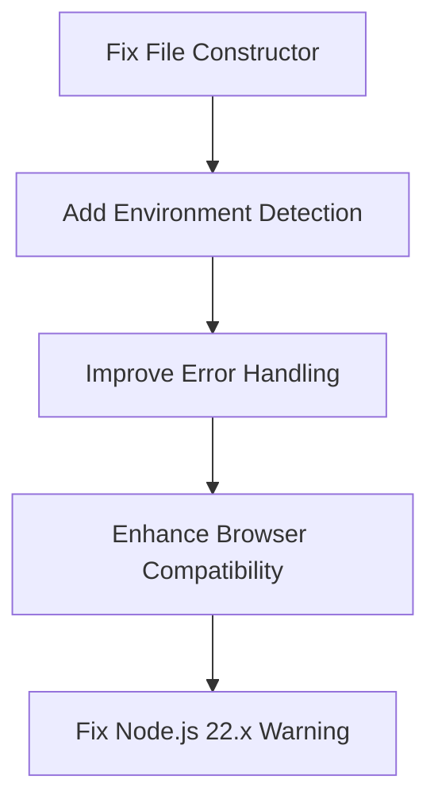
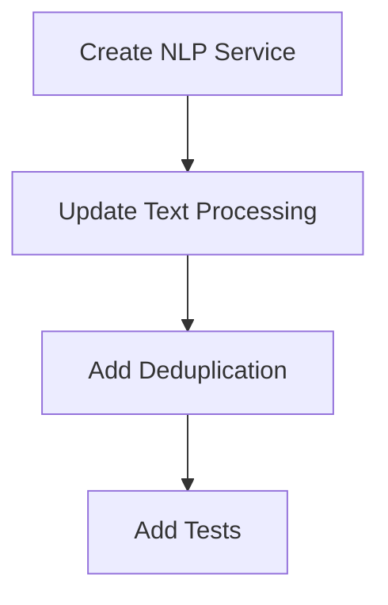
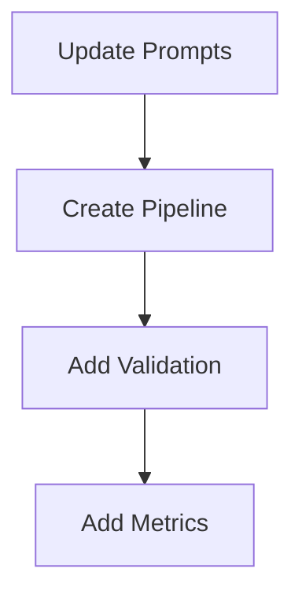
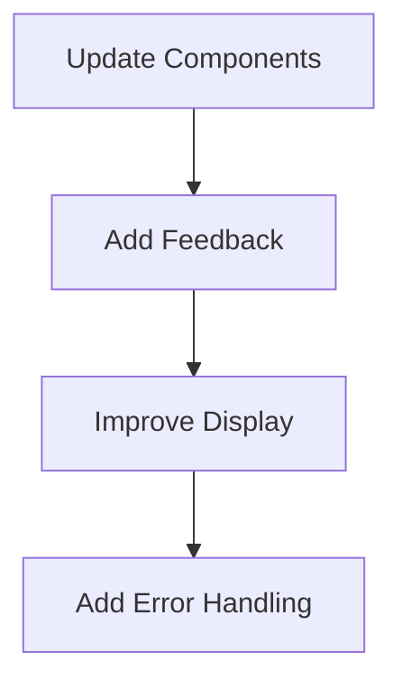

# Brain Dump App - Active Context

## Current Development Focus
We are currently working on improving the app's natural language processing capabilities and user interface, specifically addressing issues with:
1. Task detection accuracy
2. Meeting information handling
3. Metadata extraction and display

## Recent Changes
### 2025-02-25: Implemented NLP Service with Compromise.js
- Created a modular NLP service architecture in `src/services/nlp/`
- Implemented text processing with regex patterns for better accuracy
- Added entity extraction for people and locations
- Improved time and date handling
- Enhanced thought categorization logic
- Added deduplication to prevent duplicate thoughts
- Integrated the NLP service with the stream processing route

### 2025-02-25: Fixed Voice Processing in Vercel Environment
- Fixed "File is not defined" error in Vercel serverless environment
- Updated transcribeAudio function to handle browser vs. server environments
- Enhanced error handling and logging in stream processing
- Improved audio data handling in ThoughtForm component
- Added browser detection and environment-specific handling
- Fixed experimental warning in Node.js 22.x by avoiding File constructor completely

## Current Issues

### 0. Voice Processing Issues (FIXED)
~~Issue: Voice recording not working in Vercel production environment~~
- ✅ Fixed "File is not defined" error in serverless environment
- ✅ Added environment detection and conditional logic
- ✅ Improved error handling and logging
- ✅ Enhanced browser compatibility
- ✅ Fixed experimental warning in Node.js 22.x by avoiding File constructor completely

### 0.1. Microphone Selection Issue (FIXED)
~~Issue: Opera browser only capturing "you" in voice recordings~~
- ✅ Added microphone selection functionality
- ✅ Created MicrophoneSelector component with device enumeration
- ✅ Implemented microphone testing with volume meter
- ✅ Added localStorage persistence for selected microphone
- ✅ Fixed Opera-specific audio capture issues

### 1. Task Detection Problems
Example input: "I need to drink water, I need to tidy the plate, I need to brush the dog, I need to brush the cat"
Current behavior:
- Missing tasks like "tidy plate" and "brush cat"
- Inconsistent task extraction
- No relationship detection between similar tasks

### 2. Meeting Information Issues
Example input: "I have a meeting tomorrow at 10am and a meeting with Karen at 2pm tomorrow"
Current behavior:
- Duplicates "Meeting with Karen"
- Empty "With:" fields despite having person information
- Time format inconsistencies
- Missing location information

### 3. UI Feedback Issues
Current problems:
- Limited processing status feedback
- Inconsistent metadata display
- Basic error handling
- No progress indicators

## Immediate Tasks

### Phase 0: Voice Processing Fixes (COMPLETED)
Status: Completed

Key tasks:
1. ✅ Update transcribeAudio function to avoid using File constructor in server environment
2. ✅ Add environment detection for browser vs. server
3. ✅ Improve error handling and logging
4. ✅ Enhance browser compatibility for different audio formats
5. ✅ Fix experimental warning in Node.js 22.x by avoiding File constructor completely

### Phase 1: Rule-Based Processing
Status: Implemented

Key tasks:
1. ✅ Create `src/services/nlp/index.ts`
2. ✅ Implement entity extraction in `src/services/nlp/entities.ts`
3. ✅ Improve time processing in `src/services/nlp/time.ts`
4. ✅ Implement deduplication logic
5. ⬜ Add comprehensive tests

### Phase 2: LLM Integration
Status: Planning

Key tasks:
1. Create prompt templates
2. Implement processing pipeline
3. Add JSON validation
4. Add performance metrics

### Phase 3: UI Improvements
Status: Planning

Key tasks:
1. Update ProcessingStatus component
2. Add progress indicators
3. Improve metadata display
4. Enhance error handling

## Next Steps
1. Complete Phase 1
   - Add comprehensive tests for the NLP service
   - Measure accuracy improvements with real-world examples
   - Refine regex patterns based on test results

2. Proceed to Phase 2
   - Update LLM integration to work with the new NLP service
   - Implement processing pipeline with confidence scoring
   - Add validation and metrics

3. Begin Phase 3
   - Update UI components to show better processing feedback
   - Improve metadata display
   - Enhance error handling

## Dependencies
1. Phase 1 → Phase 2
   - Rule-based processing must be working before LLM integration
   - Tests must be in place

2. Phase 2 → Phase 3
   - Processing pipeline must be stable
   - Error handling must be implemented

## Current Metrics
Initial metrics to be established after first implementation phase.

Target metrics:
- Task detection rate: > 95%
- Event deduplication rate: > 99%
- Metadata extraction accuracy: > 90%
- Processing time: < 2s
- Error rate: < 1%

## Recent Decisions
1. Server-side audio processing approach:
   - Use environment detection to handle browser vs. server differences
   - Directly append Blob to FormData in all environments
   - Avoid File constructor completely to prevent experimental warnings
   - Add detailed logging for debugging

2. Maintain current LLM (Claude-3-Haiku) due to:
   - Cost effectiveness ($0.0005/1K tokens)
   - Good performance
   - Existing integration

3. Adopt hybrid approach:
   - Rule-based processing first
   - LLM as fallback for uncertain cases
   - Focus on improving prompts

4. Prioritize immediate improvements:
   - Better regex patterns
   - Enhanced time/date handling
   - Improved person/location detection
   - Deduplication logic

## Revision History
- 2025-02-25: Updated with NLP service implementation and voice processing fixes
- 2024-02-24: Initial active context document created

## CRITICAL ISSUE: MongoDB Connection Not Configured

The application is currently unable to connect to MongoDB because the connection string in the `.env` file is using placeholder values. The following placeholders in `MONGODB_URI` need to be replaced with the actual credentials:

- `<username>`
- `<password>`
- `<cluster>`
- `<database>`

**Until these values are correctly configured, the application will not function properly.** All database-dependent operations, including deleting thoughts, will fail.

**Next Step: The user MUST provide the correct MongoDB connection details to proceed.**

The user is deploying the application to Vercel to test if the issue persists in a production environment. We are awaiting the results of this deployment.

**Current Problem Summary:**

The delete button for approved thoughts is not working. We have confirmed the following:

1.  The MongoDB connection string in `.env` is correctly configured.
2.  The `handleDeleteClick` and `handleConfirmDelete` functions in `ContentCard.tsx` are being called (confirmed by browser console logs).
3.  The `handleDelete` function in `ReviewContainer.tsx` is *not* logging its `fetch` response, indicating the API call is likely not being made.
4.  The API route (`/api/review`) is correctly defined and handles the DELETE method.
5. We have added logging to `src/components/Review/ReviewContainer.tsx` around where the `<ContentCard />` is rendered, but we are not seeing this logging, which means the `handleDelete` function is not being called.

**Critical Next Step:**

We need the *complete* browser console logs from the Vercel deployment after clicking the delete button. This is the *only* way to determine why the `fetch` call in `ReviewContainer.tsx` is not being executed. Without these logs, we cannot proceed with debugging.
