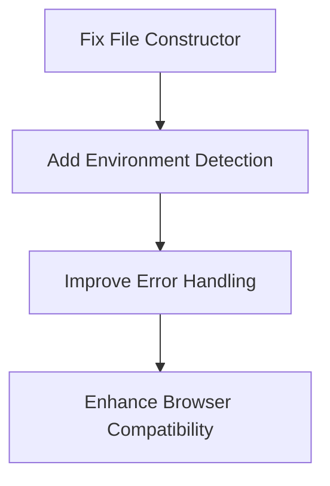
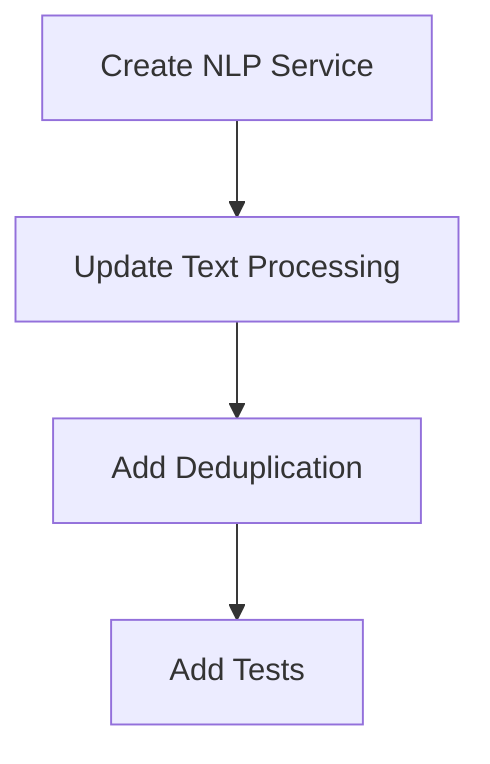
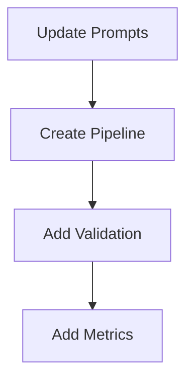
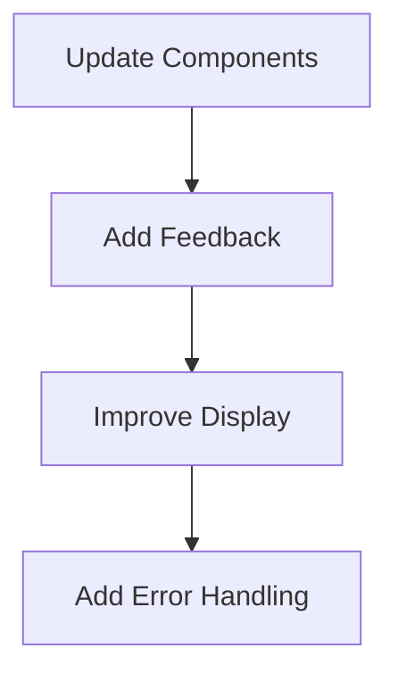

# Brain Dump App - Active Context

## Current Development Focus
We are currently working on improving the app's natural language processing capabilities and user interface, specifically addressing issues with:
1. Task detection accuracy
2. Meeting information handling
3. Metadata extraction and display

## Recent Changes
### 2025-02-25: Fixed Voice Processing in Vercel Environment
- Fixed "File is not defined" error in Vercel serverless environment
- Updated transcribeAudio function to handle browser vs. server environments
- Enhanced error handling and logging in stream processing
- Improved audio data handling in ThoughtForm component
- Added browser detection and environment-specific handling

## Current Issues

### 0. Voice Processing Issues (FIXED)
~~Issue: Voice recording not working in Vercel production environment~~
- ✅ Fixed "File is not defined" error in serverless environment
- ✅ Added environment detection and conditional logic
- ✅ Improved error handling and logging
- ✅ Enhanced browser compatibility

### 1. Task Detection Problems
Example input: "I need to drink water, I need to tidy the plate, I need to brush the dog, I need to brush the cat"
Current behavior:
- Missing tasks like "tidy plate" and "brush cat"
- Inconsistent task extraction
- No relationship detection between similar tasks

### 2. Meeting Information Issues
Example input: "I have a meeting tomorrow at 10am and a meeting with Karen at 2pm tomorrow"
Current behavior:
- Duplicates "Meeting with Karen"
- Empty "With:" fields despite having person information
- Time format inconsistencies
- Missing location information

### 3. UI Feedback Issues
Current problems:
- Limited processing status feedback
- Inconsistent metadata display
- Basic error handling
- No progress indicators

## Immediate Tasks

### Phase 0: Voice Processing Fixes (COMPLETED)
Status: Completed

Key tasks:
1. ✅ Update transcribeAudio function to avoid using File constructor in server environment
2. ✅ Add environment detection for browser vs. server
3. ✅ Improve error handling and logging
4. ✅ Enhance browser compatibility for different audio formats

### Phase 1: Rule-Based Processing
Status: Planning

Key tasks:
1. Create `src/services/nlp/index.ts`
2. Update regex patterns in `text.ts`
3. Implement deduplication logic
4. Add comprehensive tests

### Phase 2: LLM Integration
Status: Planning

Key tasks:
1. Create prompt templates
2. Implement processing pipeline
3. Add JSON validation
4. Add performance metrics

### Phase 3: UI Improvements
Status: Planning

Key tasks:
1. Update ProcessingStatus component
2. Add progress indicators
3. Improve metadata display
4. Enhance error handling

## Next Steps
1. Begin Phase 1 implementation
   - Set up NLP service structure
   - Update text processing logic
   - Add initial tests

2. Review and refine
   - Test with example inputs
   - Measure accuracy improvements
   - Gather feedback

3. Proceed to Phase 2
   - Update LLM integration
   - Implement new pipeline
   - Add monitoring

## Dependencies
1. Phase 1 → Phase 2
   - Rule-based processing must be working before LLM integration
   - Tests must be in place

2. Phase 2 → Phase 3
   - Processing pipeline must be stable
   - Error handling must be implemented

## Current Metrics
Initial metrics to be established after first implementation phase.

Target metrics:
- Task detection rate: > 95%
- Event deduplication rate: > 99%
- Metadata extraction accuracy: > 90%
- Processing time: < 2s
- Error rate: < 1%

## Recent Decisions
1. Server-side audio processing approach:
   - Use environment detection to handle browser vs. server differences
   - Directly append Blob to FormData in server environment
   - Use File constructor only in browser environment
   - Add detailed logging for debugging

2. Maintain current LLM (Claude-3-Haiku) due to:
   - Cost effectiveness ($0.0005/1K tokens)
   - Good performance
   - Existing integration

3. Adopt hybrid approach:
   - Rule-based processing first
   - LLM as fallback for uncertain cases
   - Focus on improving prompts

4. Prioritize immediate improvements:
   - Better regex patterns
   - Enhanced time/date handling
   - Improved person/location detection
   - Deduplication logic

## Revision History
- 2025-02-25: Updated with voice processing fixes for Vercel environment
- 2024-02-24: Initial active context document created
