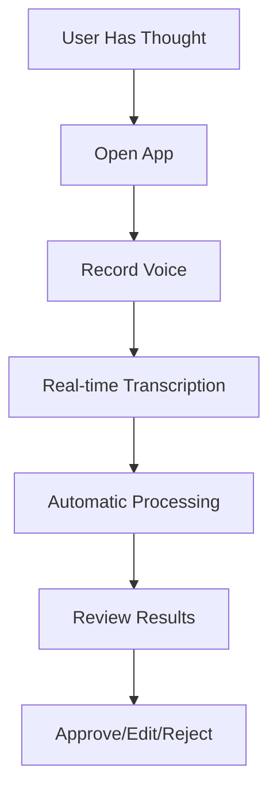

# Brain Dump App - Product Context

## Problem Statement
People often have thoughts, tasks, and events that come to mind throughout the day. Traditional note-taking and task management apps require manual input and categorization, which can be:
- Time-consuming
- Disruptive to workflow
- Error-prone
- Inconsistent in organization

## Solution
Brain Dump provides a natural, voice-first approach to capturing and organizing thoughts:
1. Users speak their thoughts naturally
2. App transcribes speech to text
3. NLP automatically categorizes and structures the input
4. Information is organized into tasks, events, and notes

## User Journey

## Core Use Cases

### 1. Task Capture
**Example Input**: "I need to buy groceries and call mom tomorrow"
**Expected Output**:
- Task: "Buy groceries"
- Event: "Call mom" (Date: tomorrow)

### 2. Meeting Scheduling
**Example Input**: "Meeting with Karen at 2pm tomorrow about project updates"
**Expected Output**:
- Event: "Meeting with Karen"
  - Time: 2:00 PM
  - Date: tomorrow
  - Context: project updates

### 3. Note Taking
**Example Input**: "The project looks promising but needs more testing"
**Expected Output**:
- Note: "The project looks promising but needs more testing"
  - Tags: project, testing

## Key Features

### 1. Voice Processing
- Real-time transcription
- Background noise handling
- Support for multiple languages (future)

### 2. Natural Language Understanding
- Context preservation
- Entity recognition (people, places, times)
- Relationship inference

### 3. Smart Categorization
- Task detection
- Event recognition
- Note classification
- Confidence scoring

### 4. Metadata Extraction
- Dates and times
- People and locations
- Priority levels
- Tags and categories

### 5. User Interface
- Real-time feedback
- Easy review process
- Quick corrections
- Organized views (tasks, events, notes)

## User Benefits

### 1. Time Savings
- Speak instead of type
- Automatic categorization
- Smart organization

### 2. Reduced Cognitive Load
- Natural interaction
- No manual categorization
- Automatic metadata extraction

### 3. Better Organization
- Consistent structure
- Clear categorization
- Easy retrieval

## Success Metrics

### 1. User Engagement
- Daily active users
- Voice recordings per user
- Approval rate of categorizations

### 2. Processing Accuracy
- Transcription accuracy
- Categorization accuracy
- Metadata extraction accuracy

### 3. User Satisfaction
- Task completion rate
- Error correction rate
- User feedback scores

## Target Users

### 1. Primary Users
- Professionals managing multiple tasks
- People who prefer voice input
- Users who need quick capture of thoughts

### 2. Secondary Users
- Teams collaborating on tasks
- Project managers
- Personal productivity enthusiasts

## Usage Patterns

### 1. Time of Use
- Morning planning
- Throughout workday
- Evening review

### 2. Frequency
- Multiple times per day
- Quick captures (< 30 seconds)
- Batch processing of thoughts

### 3. Context
- Office environment
- Mobile/on-the-go
- Home office

## Future Enhancements

### 1. Integration
- Calendar systems
- Task management tools
- Note-taking apps

### 2. Advanced Features
- Custom categorization rules
- Team collaboration
- Advanced analytics

### 3. Platform Expansion
- Mobile apps
- Desktop applications
- Browser extensions

## Revision History
- 2024-02-24: Initial product context document created
