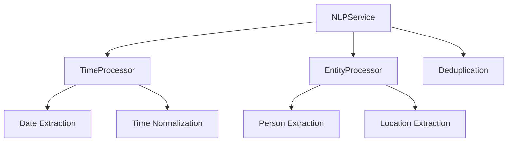
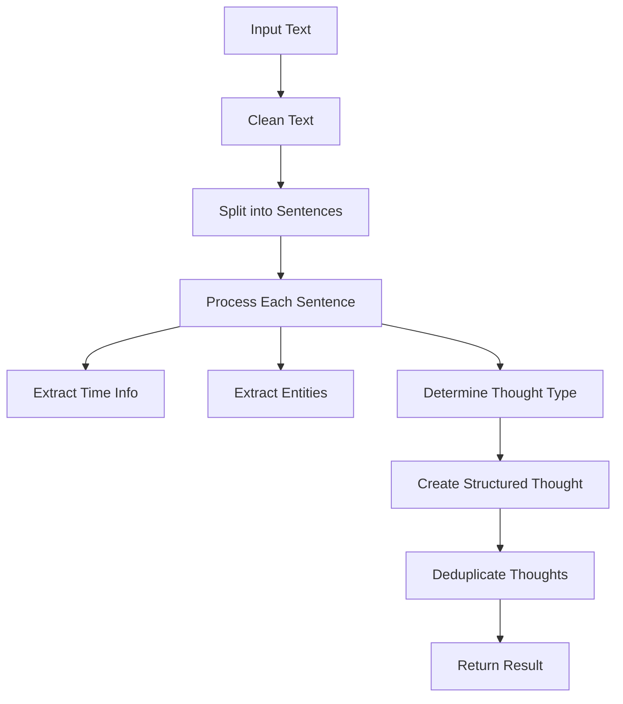

# Brain Dump App - System Patterns

## Architecture Overview

### High-Level Architecture


### Processing Pipeline


## Core Patterns

### 1. Service Layer Pattern
- NLP Service encapsulates all natural language processing logic
- Clear separation from API routes and business logic
- Modular design for easy testing and maintenance

Example (Implemented):
```typescript
// src/services/nlp/index.ts
export class NLPService {
  private timeProcessor: TimeProcessor;
  private entityProcessor: EntityProcessor;
  
  constructor(options: NLPServiceOptions = {}) {
    this.timeProcessor = new TimeProcessor();
    this.entityProcessor = new EntityProcessor();
    this.options = {
      useLLM: options.useLLM ?? true,
      confidenceThreshold: options.confidenceThreshold ?? 0.7,
      deduplicateResults: options.deduplicateResults ?? true
    };
  }
  
  async process(text: string): Promise<ProcessingResult> {
    // 1. Clean and split text
    const sentences = this.splitIntoSentences(this.cleanText(text));
    
    // 2. Process each sentence
    const thoughts = [];
    for (const sentence of sentences) {
      const sentenceThoughts = await this.processSentence(sentence);
      thoughts.push(...sentenceThoughts);
    }
    
    // 3. Deduplicate if needed
    const finalThoughts = this.options.deduplicateResults 
      ? this.deduplicateThoughts(thoughts)
      : thoughts;
      
    return {
      thoughts: finalThoughts,
      metadata: {
        processingTime: performance.now() - startTime,
        strategy: 'nlp-library',
        confidence: this.calculateOverallConfidence(finalThoughts)
      }
    };
  }
}
```

### 2. Pipeline Pattern
- Sequential processing steps
- Each step has clear inputs/outputs
- Easy to add/modify steps

Example:
```typescript
interface PipelineStep {
  process(input: any): Promise<any>;
}

class Pipeline {
  constructor(private steps: PipelineStep[]) {}
  
  async execute(input: any): Promise<any> {
    let result = input;
    for (const step of this.steps) {
      result = await step.process(result);
    }
    return result;
  }
}
```

### 3. Repository Pattern
- Abstracts database operations
- Consistent interface for data access
- Easy to switch implementations

Example:
```typescript
interface ThoughtRepository {
  save(thought: Thought): Promise<void>;
  findById(id: string): Promise<Thought>;
  update(id: string, thought: Thought): Promise<void>;
}
```

### 4. Strategy Pattern
- Different processing strategies (rule-based vs LLM)
- Easy to switch between strategies
- Consistent interface

Example:
```typescript
interface ProcessingStrategy {
  process(text: string): Promise<ProcessingResult>;
}

class RuleBasedStrategy implements ProcessingStrategy {
  async process(text: string): Promise<ProcessingResult> {
    // Rule-based processing logic
  }
}

class LLMStrategy implements ProcessingStrategy {
  async process(text: string): Promise<ProcessingResult> {
    // LLM processing logic
  }
}
```

### 5. Observer Pattern
- Real-time UI updates
- Progress notifications
- Error handling

Example:
```typescript
interface ProcessingObserver {
  onProgress(status: string): void;
  onComplete(result: ProcessingResult): void;
  onError(error: Error): void;
}
```

## Data Flow

### 1. Voice Processing Flow


### 2. Text Processing Flow


### 3. Event Processing Flow


## Error Handling

### 1. Error Types
```typescript
type ProcessingError =
  | TranscriptionError
  | ParsingError
  | ValidationError
  | StorageError;
```

### 2. Error Recovery


## State Management

### 1. Processing State
```typescript
type ProcessingState =
  | 'idle'
  | 'recording'
  | 'transcribing'
  | 'processing'
  | 'complete'
  | 'error';
```

### 2. UI State Flow


## Testing Patterns

### 1. Unit Tests
- Test individual functions
- Mock external services
- Test edge cases

### 2. Integration Tests
- Test pipeline steps
- Test service interactions
- Test data flow

### 3. E2E Tests
- Test complete flows
- Test UI interactions
- Test error scenarios

## Performance Patterns

### 1. Caching
- Cache common patterns
- Cache LLM results
- Cache UI components

### 2. Lazy Loading
- Load components on demand
- Load data as needed
- Defer processing

### 3. Batching
- Batch database operations
- Batch API calls
- Batch UI updates

## Monitoring Patterns

### 1. Metrics
- Processing time
- Error rates
- API usage

### 2. Logging
- Request/response logging
- Error logging
- Performance logging

### 3. Alerts
- Error thresholds
- Performance thresholds
- Cost thresholds

## NLP Service Architecture

### Components


### Processing Flow


## Revision History
- 2025-02-25: Updated with NLP service implementation details
- 2024-02-24: Initial system patterns document created
